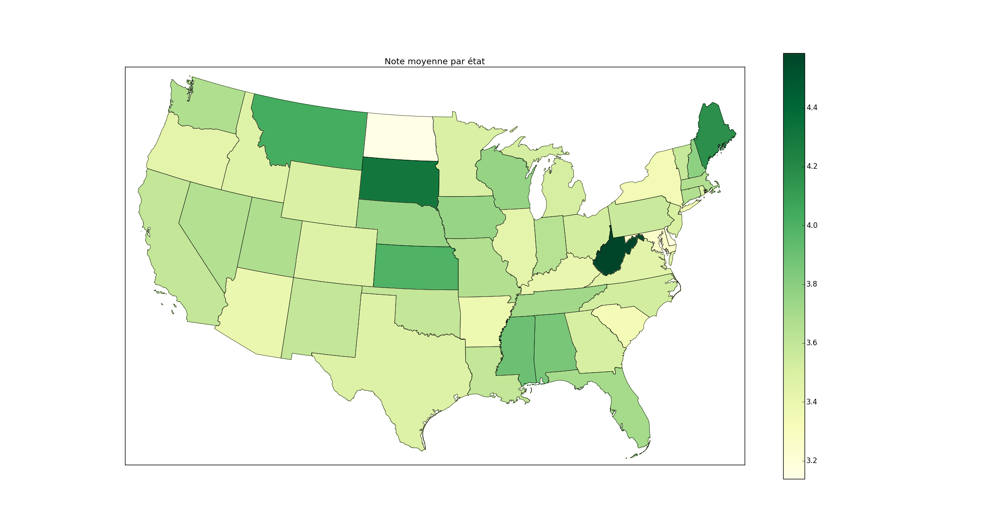

# MovieLens analysis

MovieLens is a movie recommendation website. It provides a [popular dataset](http://files.grouplens.org/datasets/movielens/ml-10m-README.html) that many people have built tutorials on.

As a university assignement (``ProjetSid.pdf``), Giovanni Zanitti and I had to figure out if clusters of individuals could be extracted. The whole report is named ``Rapport_Zanitti_Halford.pdf`` and details the procedures we took and the choices we made.

The data munging was performed with Python (and the [pandas module](http://pandas.pydata.org/)) whilst the statistical analysis was done with R (thanks to the [FactoMineR package](http://factominer.free.fr/index.html)).

Here are some plot examples:

We also produced a map of the United States showing the average scores given to the movies by the users, but it was not included in the report:

For more information our contacts are:

- ``maxhalford25@gmail.com``
- ``giovanni.zanitti@gmail.com``